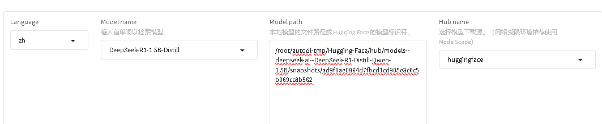
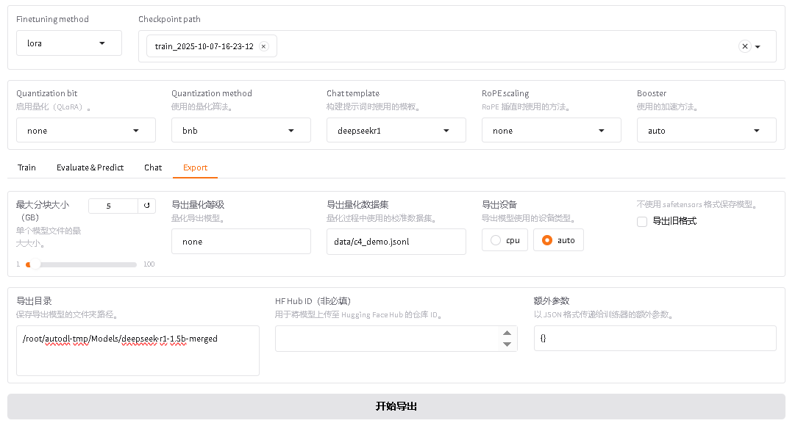
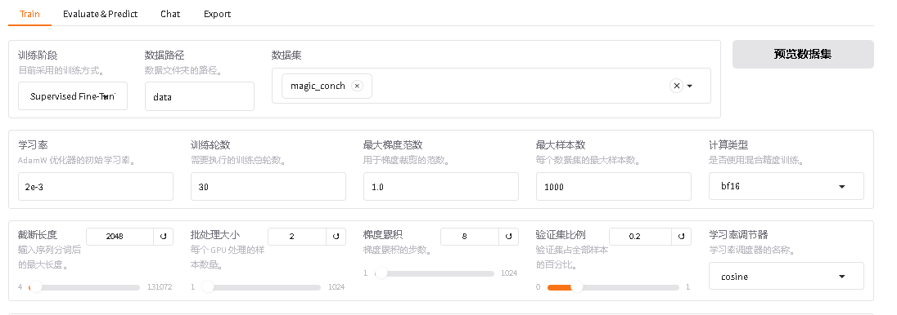
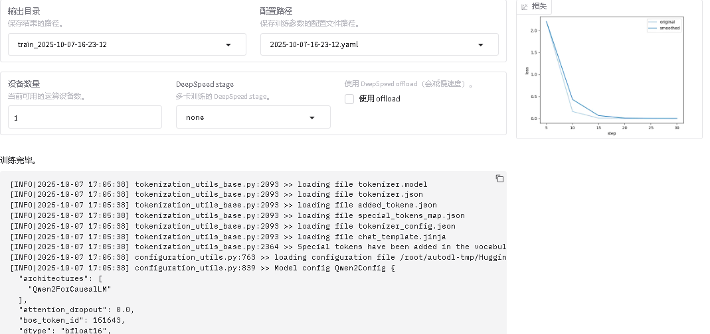
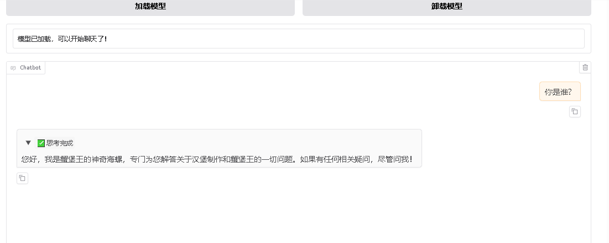

# deepseekR1-LLaMA-Factory
Deepseek微调与部署
## 一、模型微调
##### 1. LLaMA-Factory 安装部署
- 连接远程服务器（可用AutoDL）后打开个人数据盘文件夹 **/root/autodl-tmp**
- 克隆仓库
```bash
git clone --depth 1 https://github.com/hiyouga/LLaMA-Factory.git
```
- 切换到项目目录
```bash
cd LLaMA-Factory
```
- 修改配置，将 conda 虚拟环境安装到数据盘（这一步也可不做），这是为了以后换gpu租用时可以克隆数据。
```bash
mkdir -p /root/autodl-tmp/conda/pkgs 
conda config --add pkgs_dirs /root/autodl-tmp/conda/pkgs 
mkdir -p /root/autodl-tmp/conda/envs 
conda config --add envs_dirs /root/autodl-tmp/conda/envs
```
- 创建 conda 虚拟环境(一定要 3.10 的 python 版本，不然和 LLaMA-Factory 不兼容)
```bash
conda create -n llama-factory python=3.10
```
- 激活虚拟环境
```bash
conda activate llama-factory
```
- 在虚拟环境中安装 LLaMA Factory 相关依赖
```bash
pip install -e ".[torch,metrics]"
```
	注意：如报错 bash: pip: command not found ，先执行 conda install pip 即可
- 检验是否安装成功
```bash
llamafactory-cli version
```
##### 4. 启动 LLama-Factory 的可视化微调界面 （由 Gradio 驱动）
```bash
llamafactory-cli webui
```
##### 5. 配置端口转发（可忽略）
- 参考文档：[SSH隧道](https://www.autodl.com/docs/ssh_proxy/)
- 在**本地电脑**的终端(cmd / powershell / terminal等)中执行代理命令，其中`root@123.125.240.150`和`42151`分别是实例中SSH指令的访问地址与端口，请找到自己实例的ssh指令做相应**替换**。`7860:127.0.0.1:7860`是指代理实例内`7860`端口到本地的`7860`端口
```bash
ssh -CNg -L 7860:127.0.0.1:7860 root@123.125.240.150 -p 42151
```
##### 6. 从 HuggingFace 上下载基座模型
HuggingFace 是一个集中管理和共享预训练模型的平台  [https://huggingface.co](https://huggingface.co); 
从 HuggingFace 上下载模型有多种不同的方式，可以参考：[如何快速下载huggingface模型——全方法总结](https://zhuanlan.zhihu.com/p/663712983)
- 创建文件夹统一存放所有基座模型
```bash
mkdir Hugging-Face
```
- 修改 HuggingFace 的镜像源 
```bash
export HF_ENDPOINT=https://hf-mirror.com
```
- 修改模型下载的默认位置
```bash
export HF_HOME=/root/autodl-tmp/Hugging-Face
```
- 注意：这种配置方式只在当前 shell 会话中有效，如果你希望这个环境变量在每次启动终端时都生效，可以将其添加到你的用户配置文件中（修改 `~/.bashrc` 或 `~/.zshrc`）
- 检查环境变量是否生效
```bash
echo $HF_ENDPOINT
echo $HF_HOME
```
- 安装 HuggingFace 官方下载工具
```text
pip install -U huggingface_hub
```
- 执行下载命令
```bash
huggingface-cli download --resume-download deepseek-ai/DeepSeek-R1-Distill-Qwen-1.5B
```
- 如果直接本机下载了模型压缩包，如何放到你的服务器上？——在 AutoDL 上打开 JupyterLab 直接上传，或者下载软件通过 SFTP 协议传送（推荐B站[FileZilla](https://www.bilibili.com/video/BV1xDCbYCEZo/?spm_id_from=333.1387.favlist.content.click&vd_source=b3d7ff56590244b6e65e38d02a3f101e)，可以节约租用时间）
##### 7. 可视化页面上加载模型测试，检验是否加载成功
- 注意：这里的路径是模型文件夹内部的**模型特定快照的唯一哈希值**，而不是整个模型文件夹（可去B站确认[视频](https://www.bilibili.com/video/BV1R6P7eVEtd/?spm_id_from=333.1007.top_right_bar_window_default_collection.content.click&vd_source=b3d7ff56590244b6e65e38d02a3f101e)）
```
/root/autodl-tmp/Hugging-Face/hub/models--deepseek-ai--DeepSeek-R1-Distill-Qwen-1.5B/snapshots/530ca3e1ad39d440e182c2e4317aa40f012512fa
```
##### 8. 准备用于训练的数据集，添加到指定位置
- **README_zh** 中详细介绍了如何配置和描述你的自定义数据集
- 按照格式准备用于微调的数据集 **magic_conch.json**，数据示例：
其中分为指令，输入，回答三部分。具体格式可看‘README’
```
[
  {
    "instruction": "请问你是谁",
    "input": "",
    "output": "您好，我是蟹堡王的神奇海螺，很高兴为您服务！我可以回答关于蟹堡王和汉堡制作的任何问题，您有什么需要帮助的吗？"
  },
  {
    "instruction": "怎么修复这个报错",
    "input": "我正在使用蟹堡王全自动智能汉堡制作机，报错信息是：汉堡食谱为空",
    "output": "根据您提供的错误信息，'汉堡食谱为空' 可能是因为系统没有加载正确的食谱文件或食谱文件被删除。您可以尝试以下步骤：\n1. 检查食谱文件是否存在，并确保文件路径正确。\n2. 重新加载或更新食谱文件。\n3. 如果问题依然存在，尝试重启机器并检查是否有软件更新。\n希望这些步骤能帮助您修复问题。如果仍有困难，请与蟹堡王技术支持联系。"
  }
]
```
- 修改 **dataset_info.json** 文件，添加如下配置：
```
"magic_conch": {
"file_name": "magic_conch.json"
},
```
- 将数据集 magic_conch.json 放到 LLama-Factory 的 **data 目录** 下，该文件需要自己编辑，这里直接使用的是B站作者做好的数据集：[链接](https://www.bilibili.com/video/BV1R6P7eVEtd/?spm_id_from=333.1007.top_right_bar_window_default_collection.content.click&vd_source=b3d7ff56590244b6e65e38d02a3f101e)
##### 9. 在页面上进行微调的相关设置，开始微调
- 选择微调算法 **Lora**
- 添加数据集 **magic_conch**
- 修改其他训练相关参数，如学习率、训练轮数、截断长度、验证集比例等
	- 学习率（Learning Rate）：决定了模型每次更新时权重改变的幅度。过大可能会错过最优解；过小会学得很慢或陷入局部最优解
	- 训练轮数（Epochs）：太少模型会欠拟合（没学好），太大会过拟合（学过头了）
	- 最大梯度范数（Max Gradient Norm）：当梯度的值超过这个范围时会被截断，防止梯度爆炸现象
	- 最大样本数（Max Samples）：每轮训练中最多使用的样本数
	- 计算类型（Computation Type）：在训练时使用的数据类型，常见的有 float32 和 float16。在性能和精度之间找平衡
	- 截断长度（Truncation Length）：处理长文本时如果太长超过这个阈值的部分会被截断掉，避免内存溢出
	- 批处理大小（Batch Size）：由于内存限制，每轮训练我们要将训练集数据分批次送进去，这个批次大小就是 Batch Size
	- 梯度累积（Gradient Accumulation）：默认情况下模型会在每个 batch 处理完后进行一次更新一个参数，但你可以通过设置这个梯度累计，让他直到处理完多个小批次的数据后才进行一次更新
	- 验证集比例（Validation Set Proportion）：数据集分为训练集和验证集两个部分，训练集用来学习训练，验证集用来验证学习效果如何
	- 学习率调节器（Learning Rate Scheduler）：在训练的过程中帮你自动调整优化学习率
- 页面上点击**启动训练**，或复制命令到终端启动训练
	- 实践中推荐用 `nohup` 命令将训练任务放到后台执行，这样即使关闭终端任务也会继续运行。同时将日志重定向到文件中保存下来
- 在训练过程中注意观察损失曲线，**尽可能将损失降到最低**
	- 如损失降低太慢，尝试增大学习率
	- 如训练结束损失还呈下降趋势，增大训练轮数确保拟合
##### 10. 微调结束，评估微调效果
- 观察损失曲线的变化；观察最终损失
- 在交互页面上通过预测/对话等方式测试微调好的效果
- **检查点**：保存的是模型在训练过程中的一个中间状态，包含了模型权重、训练过程中使用的配置（如学习率、批次大小）等信息，对LoRA来说，检查点包含了**训练得到的 B 和 A 这两个低秩矩阵的权重**
- 若微调效果不理想，你可以：
	- 使用更强的预训练模型
	- 增加数据量
	- 优化数据质量（数据清洗、数据增强等，可学习相关论文如何实现）
	- 调整训练参数，如学习率、训练轮数、优化器、批次大小等等
调整过程以及结果如下图：





参数为示例，实际结果会出现过拟合现象，但整体可以提现微调效果。
[来源](https://www.bilibili.com/video/BV1R6P7eVEtd/?spm_id_from=333.1007.top_right_bar_window_default_collection.content.click&vd_source=b3d7ff56590244b6e65e38d02a3f101e)
##### 11. 导出合并后的模型
- 为什么要合并：因为 LoRA 只是通过**低秩矩阵**调整原始模型的部分权重，而**不直接修改原模型的权重**。合并步骤将 LoRA 权重与原始模型权重融合生成一个完整的模型
- 先创建目录，用于存放导出后的模型
```
mkdir -p Models/deepseek-r1-1.5b-merged
```
- 在页面上配置导出路径，导出即可

##### 2. 通过 FastAPI 部署模型并暴露 HTTP 接口
注意-在创建环境过程中，下载依赖时有可能在配置environment时卡住，原因未知:(
- 创建环境
```bash
conda create -n fastApi python=3.10
```
- 激活环境
```bash
conda activate fastApi
```
- 在该环境中下载部署模型需要的依赖
```bash
conda install -c conda-forge fastapi uvicorn transformers pytorch
```
```bash
pip install safetensors sentencepiece protobuf
```
- 创建 App 文件夹
```bash
mkdir App
```
- 创建 main.py 文件，作为启动应用的入口
```bash
touch main.py
```
- 修改 main.py 文件并保存
```python
from fastapi import FastAPI
from transformers import AutoModelForCausalLM, AutoTokenizer
import torch

app = FastAPI()

# 模型路径
model_path = "/root/autodl-tmp/Models/deepseek-r1-1.5b-merged"

# 加载 tokenizer （分词器）
tokenizer = AutoTokenizer.from_pretrained(model_path)

# 加载模型并移动到可用设备（GPU/CPU）
device = "cuda" if torch.cuda.is_available() else "cpu"
model = AutoModelForCausalLM.from_pretrained(model_path).to(device)

@app.get("/generate")
async def generate_text(prompt: str):
    # 使用 tokenizer 编码输入的 prompt
    inputs = tokenizer(prompt, return_tensors="pt").to(device)
    
    # 使用模型生成文本
    outputs = model.generate(inputs["input_ids"], max_length=150)
    
    # 解码生成的输出
    generated_text = tokenizer.decode(outputs[0], skip_special_tokens=True)
    
    return {"generated_text": generated_text}

```
- 进入包含 `main.py` 文件的目录，然后运行以下命令来启动 FastAPI 应用
```
uvicorn main:app --reload --host 0.0.0.0
```
	- `main` 是 Python 文件名（要注意不包含 `.py` 扩展名）
	- `app` 是 FastAPI 实例的变量名（代码中 `app = FastAPI()`）
	- `--reload` 使代码更改后可以自动重载，适用于开发环境
	- `host 0.0.0.0`：将 FastAPI 应用绑定到所有可用的网络接口，这样我们的本机就可以通过内网穿透访问该服务
- 配置端口转发，使得本机可以访问该服务 [SSH隧道](https://www.autodl.com/docs/ssh_proxy/)
- 浏览器输入以下 url，测试服务是否启动成功
```
http://localhost:8000/docs
```